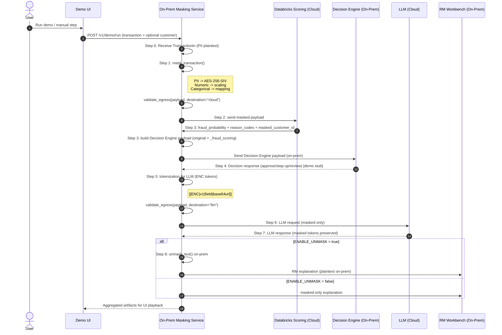

# PII Masking Service

Microservice for masking/anonymizing card transactions before sending data to cloud analytics (Databricks) for fraud detection.

Russian version: `README.ru.md`

## 🎯 Goal

Securely send transaction data to the cloud while preserving the ability to:
- Train ML models
- Score transactions
- Perform JOINs on keys
- Run analytics without access to PII

## ✨ Capabilities

| Data Type | Transformation | Reversible |
|------------|---------------|------------|
| PII fields | AES-256-SIV encryption | ✅ |
| Numeric fields | Diagonal matrix scaling (×scale) | ✅ |
| MCC | Bijective permutation | ✅ |
| Channel | Deterministic mapping | ✅ |

**All transformations are deterministic** — the same input always produces the same output.

Additionally:
- ✅ Data Classification on schema level (PUBLIC/INTERNAL/CONFIDENTIAL/PII/PCI)
- ✅ Policy enforcement before egress to Cloud/LLM
- ✅ LLM explainability flow with ENC tokens `[[ENC|v1|field|ciphertext]]`

## 🔁 Sequence Diagram (End-to-End)



Summary:
- Step 0: Service receives the raw transaction JSON with PII.
- Step 1: Masking (PII → AES-256-SIV, numeric → scaling, categorical → mapping).
- Step 2–3: Cloud scoring round-trip with masked payload.
- Step 3–4: Decision Engine payload + decision response (stub).
- Step 5–7: Tokenize PII for LLM, masked request/response.
- Step 8: On-prem de-mask and RM output.

## 📚 Documentation

- RU: `docs/PII_Masking_Service_Design_ru.md`
- EN: `docs/PII_Masking_Service_Design_en.md`

Generate documentation assets:
```bash
pip install -r docs/requirements-docs.txt
python docs/generate_assets.py
```

## 🚀 Quick Start

### Local (3 minutes)

```bash
# 1. Clone/create directory
cd pii-masking-service

# 2. Create virtual environment
python3.11 -m venv venv
source venv/bin/activate  # Linux/Mac
# or: venv\Scripts\activate  # Windows

# 3. Install dependencies
pip install -r requirements.txt

# 4. Run service
uvicorn app.main:app --reload

# 5. Open Swagger UI
open http://localhost:8000/docs
```

### Docker

```bash
# Build
docker build -t pii-masking-service .

# Run (with environment variables)
docker run -d \
  -p 8000:8000 \
  -e PII_KEY_B64="your_base64_key_here" \
  -e ENABLE_UNMASK=true \
  --name pii-masking \
  pii-masking-service

# Check
curl http://localhost:8000/health
```

## 📖 API

### `GET /health`
Service health check.

```bash
curl http://localhost:8000/health
```

Response:
```json
{
  "status": "ok",
  "version": "v1",
  "unmask_enabled": true
}
```

### `POST /v1/mask/transaction`
Mask a transaction.

```bash
curl -X POST http://localhost:8000/v1/mask/transaction \
  -H "Content-Type: application/json" \
  -d '{
    "transaction_id": "TXN-20260120-000001",
    "transaction_ts": "2026-01-20T10:15:30+03:00",
    "customer_id": "CUST-QA-00987234",
    "full_name": "Ahmed Al Mansoori",
    "phone": "+974 5512 3456",
    "email": "ahmed.almansoori@example.qa",
    "billing_address": "QA, Doha, West Bay, Diplomatic Area, Street 805, Building 12, Apt 1503",
    "card_pan": "4111111111111111",
    "merchant_id": "MRC-QA-778812",
    "merchant_name": "CARREFOUR CITY CENTER DOHA",
    "mcc": 5411,
    "merchant_country": "QA",
    "terminal_id": "TERM-QA-100200",
    "channel": "POS",
    "currency": "QAR",
    "amount": 275.50,
    "available_balance": 18350.75,
    "credit_limit": 50000.00,
    "ip_address": "203.0.113.10",
    "device_id": "DEV-qa-4f1c2a9b",
    "is_card_present": true
  }'
```

Response (structure):
```json
{
  "transaction_id": "TXN-20260120-000001",
  "transaction_ts": "2026-01-20T10:15:30+03:00",
  "customer_id": "PHqLs2NkZW1vfHYxfGN1c3RvbWVyX2lk...",
  "full_name": "AHJzY2ItZGVtb3x2MXxmdWxsX25hbWU...",
  "phone": "KHNjYi1kZW1vfHYxfHBob25l...",
  "email": "ZXNjYi1kZW1vfHYxfGVtYWls...",
  "billing_address": "YnNjYi1kZW1vfHYxfGJpbGxpbmdfYWRkcmVzcw...",
  "card_pan": "Y3NjYi1kZW1vfHYxfGNhcmRfcGFu...",
  "ip_address": "aXNjYi1kZW1vfHYxfGlwX2FkZHJlc3M...",
  "device_id": "ZHNjYi1kZW1vfHYxfGRldmljZV9pZA...",
  "merchant_id": "MRC-QA-778812",
  "merchant_name": "CARREFOUR CITY CENTER DOHA",
  "mcc": 7823,
  "merchant_country": "QA",
  "terminal_id": "TERM-QA-100200",
  "channel": "CH_ALPHA",
  "currency": "QAR",
  "amount": 377.435,
  "available_balance": 15231.1225,
  "credit_limit": 55500.0,
  "is_card_present": true,
  "mask_version": "v1"
}
```

### `POST /v1/unmask/transaction`
Restore original transaction (demo only).

```bash
curl -X POST http://localhost:8000/v1/unmask/transaction \
  -H "Content-Type: application/json" \
  -d '{"...masked transaction JSON..."}'
```

### `POST /v1/mask/customer`
Mask customer profile.

```bash
curl -X POST http://localhost:8000/v1/mask/customer \
  -H "Content-Type: application/json" \
  -d '{
    "customer_id": "CUST-QA-00987234",
    "full_name": "Ahmed Al Mansoori",
    "phone": "+974 5512 3456",
    "email": "ahmed.almansoori@example.qa",
    "address": "QA, Doha, West Bay, Diplomatic Area, Street 805, Building 12, Apt 1503",
    "kyc_segment": "GOLD",
    "preferred_language": "EN"
  }'
```

### `POST /v1/mask/text`
Replace sensitive values with ENC tokens.

```bash
curl -X POST http://localhost:8000/v1/mask/text \
  -H "Content-Type: application/json" \
  -d '{
    "text": "Call Ahmed about 275.50 QAR at CARREFOUR",
    "replacements": {
      "customer_name": "Ahmed",
      "amount": "275.50",
      "merchant_name": "CARREFOUR"
    }
  }'
```

### `POST /v1/unmask/text`
Restore ENC tokens (demo only).

```bash
curl -X POST http://localhost:8000/v1/unmask/text \
  -H "Content-Type: application/json" \
  -d '{
    "masked_text": "Call [[ENC|v1|customer_name|...]] about [[ENC|v1|amount|...]]"
  }'
```

### `POST /v1/fraud/explain`
Full on-prem -> cloud -> LLM -> RM flow. LLM receives masked payload only.

```bash
curl -X POST http://localhost:8000/v1/fraud/explain \
  -H "Content-Type: application/json" \
  -d '{
    "transaction": { "...sample transaction..." },
    "customer": { "...sample customer..." }
  }'
```

## 🎮 Demo Client

```bash
# Run demo
python demo_client.py

# With different URL
python demo_client.py --base-url http://192.168.1.100:8000
```

### End-to-End Explainability Demo

```bash
# Full on-prem -> cloud -> LLM -> RM flow
python demo_end_to_end.py
```

Demo shows:
1. ✅ Health check
2. 📤 Sending transaction for masking
3. 📊 Transformation details (PII → ciphertext, numbers × scale, categories)
4. 🔄 Determinism check (repeat request)
5. 🔓 Original data restoration (unmask)
6. ✔️ Verification of equality

## ⚙️ Configuration

Environment variables (see `.env.example`):

| Variable | Description | Default |
|------------|----------|--------------|
| `PII_KEY_B64` | Encryption key (64 bytes, base64) | Randomly generated |
| `MASK_VERSION` | Masking version | `v1` |
| `ENABLE_UNMASK` | Enable /unmask endpoint | `true` |
| `ENABLE_UNMASK_TEXT` | Enable /unmask/text endpoint | `true` |
| `SCALE_AMOUNT` | Scale factor for amount | `1.37` |
| `SCALE_AVAILABLE_BALANCE` | Scale factor for available_balance | `0.83` |
| `SCALE_CREDIT_LIMIT` | Scale factor for credit_limit | `1.11` |
| `CAT_SEED` | Seed for categorical permutation | Derived from key |
| `LOG_HASH_SALT` | Salt for safe logging | empty |

### Generate key

```bash
python -c "import secrets, base64; print(base64.b64encode(secrets.token_bytes(64)).decode())"
```

## 🔐 Security

### PII Encryption
- Algorithm: **AES-256-SIV** (Synthetic IV)
- Deterministic AEAD — same input produces same output
- Domain separation: same value in different fields produces different ciphertext
- Associated Data: `scb-demo|v1|{field_name}`

### ENC tokens for LLM
LLM never receives plaintext data. Instead, the request uses tokens:

```
[[ENC|v1|<field_name>|<base64url_ciphertext>]]
```

- Tokens are generated on-prem from real values (strings/numbers)
- LLM must copy tokens as-is
- After response, `unmask_text()` restores readable text

### Numeric fields
- Diagonal matrix: `x_masked = x × scale_factor`
- Scale factors are stored as service secrets
- Reversible: `x = x_masked / scale_factor`

Example (diagonal matrix multiplication):

$$
\mathbf{x} = \begin{bmatrix}275.50\\18350.75\\50000.00\end{bmatrix},\quad
D = \begin{bmatrix}1.37 & 0 & 0\\0 & 0.83 & 0\\0 & 0 & 1.11\end{bmatrix},\quad
\mathbf{x'} = D\mathbf{x} = \begin{bmatrix}377.435\\15231.1225\\55500.00\end{bmatrix}
$$

### Categorical fields
- **MCC**: bijective permutation 0-9999 by seed
- **Channel**: fixed mapping (POS→CH_ALPHA, etc.)

## 📁 Project structure

```
pii-masking-service/
├── app/
│   ├── __init__.py
│   ├── main.py          # FastAPI app
│   ├── config.py        # Configuration and secrets
│   ├── schemas.py       # Pydantic models
│   ├── masking.py       # Masking logic
│   ├── classification.py # Data classification + policy enforcement
│   ├── text_masking.py   # ENC tokens for LLM
│   ├── cloud_stub.py     # Stub cloud scoring
│   └── llm_stub.py       # Stub LLM
├── requirements.txt
├── Dockerfile
├── .env.example
├── README.md
├── demo_client.py
└── demo_end_to_end.py
```

## 🧪 Testing

```bash
# Start service
uvicorn app.main:app --reload &

# Run demo client
python demo_client.py

# Health check
curl http://localhost:8000/health

# Swagger UI
open http://localhost:8000/docs
```

## 📋 Demo checklist

- [ ] Start service: `uvicorn app.main:app --reload`
- [ ] Open Swagger UI: http://localhost:8000/docs
- [ ] Show `/health` endpoint
- [ ] Show `/v1/mask/transaction` with sample JSON
- [ ] Highlight:
  - PII fields became base64url strings
  - Numbers changed (×scale)
  - MCC changed (permutation)
  - Channel changed (mapping)
  - `mask_version` added
- [ ] Repeat request to show determinism
- [ ] Show `/v1/unmask/transaction` — restoration
- [ ] Run `demo_client.py` for automated demo

## 📜 License

Internal use only. Not for distribution.

---

*Built for demonstrating PII masking in a card fraud detection pipeline.*
