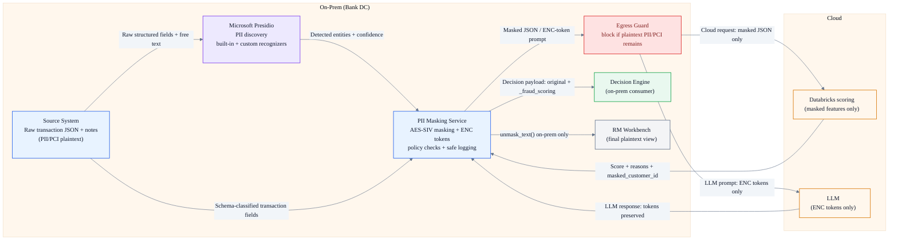
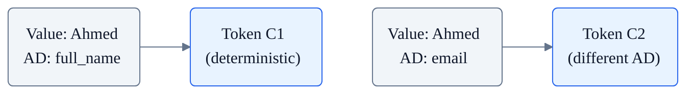
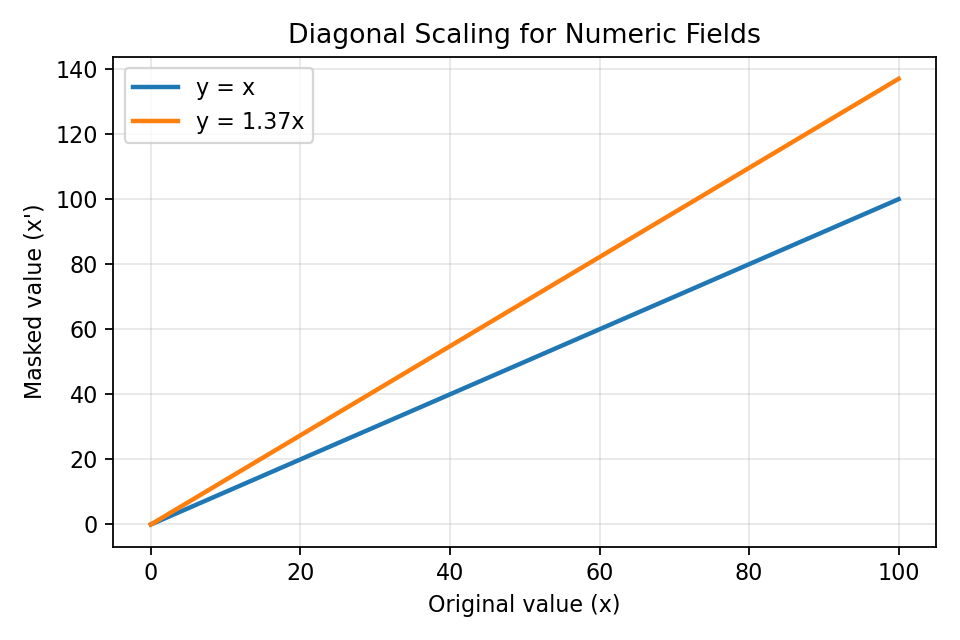
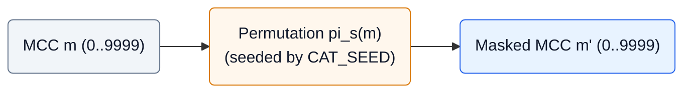
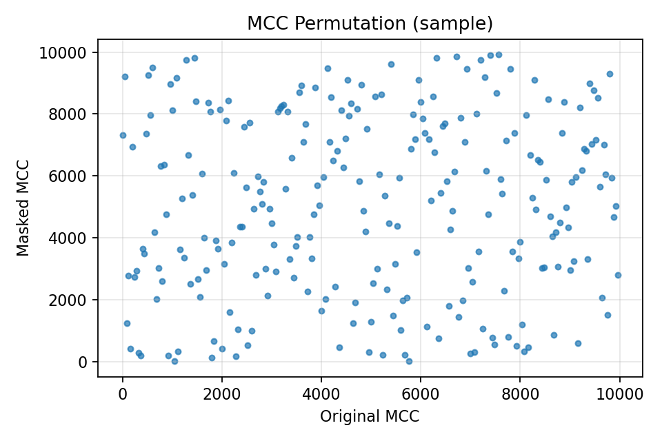
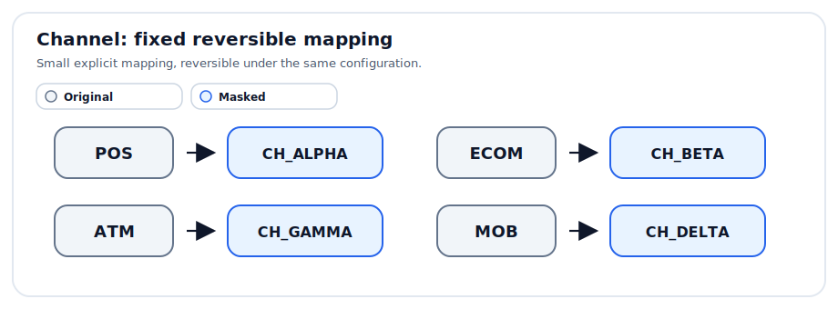
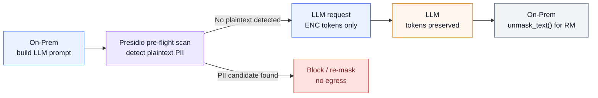
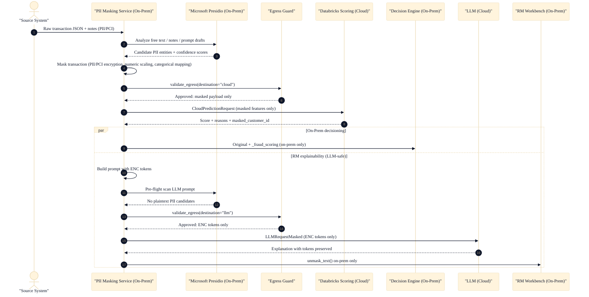

# PII Masking Service (Demo)

On-prem privacy-by-design pipeline for fraud analytics and RM explainability:
mask sensitive fields, score in the cloud on masked features, decide on-prem, and generate RM notes via an LLM without sending plaintext to the LLM.

The pipeline can also use **Microsoft Presidio** as an on-prem PII discovery layer for unstructured text, operator notes, and LLM prompt drafts. Presidio helps identify candidate sensitive entities before masking, while this project's deterministic encryption, ENC tokenization, egress policy checks, and safe logging remain the enforcement controls.


## Executive Summary

This demo illustrates a bank-grade principle: **data minimization + deterministic protection controls**.

Key guarantees (as implemented in code):
- **No plaintext PII/PCI goes to the cloud** (cloud sees masked features only).
- **No plaintext sensitive values go to the LLM** (LLM sees deterministic `[[ENC|...]]` tokens only).
- **De-masking happens on-prem only**, under explicit feature flags.
- Deterministic transforms preserve **joinability** for modeling and analytics (same input, same output).
- **Presidio-assisted PII discovery** can identify candidate entities in free text before masking. Domain schema classification remains authoritative for structured transaction fields, and egress validation remains the final leakage guard.

## Security & Governance (Why This Is Safe)

These are runtime controls (not just documentation):

- **Data classification** is attached to schema fields (Swagger shows `classification` metadata).
- **Egress policy enforcement** blocks any plaintext PII/PCI before cloud/LLM egress: `validate_egress(payload, destination="cloud"|"llm")`.
- **LLM prompt safety check** blocks accidental plaintext leakage in the prompt string (the LLM request must contain ENC tokens only).
- **Safe logging** redacts/hashes sensitive fields so plaintext PII/PCI is never written to logs.
- **Feature flags for unmasking** keep plaintext output opt-in (`ENABLE_UNMASK`, `ENABLE_UNMASK_TEXT`).
- **Microsoft Presidio pre-flight detection** can run on-prem before cloud/LLM egress to detect plaintext PII in free-text payloads. Built-in and custom recognizers can flag names, emails, phone numbers, cards, locations, and project-specific IDs. Presidio findings are treated as an additional detection signal, not as the only protection control.

## Microsoft Presidio Layer

The service includes Microsoft Presidio endpoints as an on-prem text PII discovery and transformation layer for synthetic/demo text:

- **Analyzer**: detects candidate entities such as `PERSON`, `EMAIL_ADDRESS`, `PHONE_NUMBER`, `CREDIT_CARD`, and `LOCATION`.
- **Anonymizer**: replaces detected values with placeholders such as `<EMAIL_ADDRESS>` or `<PHONE_NUMBER>`.
- **Redactor**: removes detected PII from the text.
- **Custom recognizers**: project IDs such as `CUSTOMER_ID` (`CUST-QA-00987234`) and `CASE_ID` (`CASE-2026-0001`) are detected with regex recognizers.

Synthetic demo text, aligned with the main transaction demo:

```text
Ahmed Al Mansoori lives in Doha. His email is ahmed.almansoori@example.qa, phone is +974 5512 3456, card is 4111111111111111, and customer id is CUST-QA-00987234.
```

Operational notes:

- Presidio is a detection aid, not a guarantee. Sensitive workflows still require domain validation.
- Raw text is accepted only by on-prem API endpoints; do not log raw text.
- The default English NLP model is `en_core_web_lg`.
- Russian/local-language support should be added through custom recognizers and a dedicated NLP engine configuration.

## Architecture (One Slide)



## What Goes Where 

| Destination | Payload type | Plaintext PII/PCI | What it enables |
|---|---|---|---|
| Cloud scoring (Databricks) | `CloudPredictionRequest` | No | Fraud scoring on masked features |
| LLM (cloud) | `LLMRequestMasked` | No | RM explanation text with ENC tokens |
| Decision Engine (on-prem) | Original + `_fraud_scoring` | Yes (on-prem only) | Final on-prem decisioning |

## Data Transformations (Deterministic and Reversible)

### 0) PII Discovery: Microsoft Presidio

Purpose: detect candidate PII in unstructured text before deterministic protection controls are applied.

Presidio complements the schema-level classification already used by this demo:

- structured transaction fields are protected by field-level rules and deterministic encryption;
- free-text notes, LLM prompt drafts, and operator-entered text can be scanned by Presidio Analyzer;
- project-specific identifiers such as `CUSTOMER_ID`, `CASE_ID`, transaction references, or internal ticket numbers can be added via custom recognizers;
- Presidio results are used as an additional signal, while egress validation remains the final control.

Example using the same synthetic data as the main demo:

```text
Ahmed Al Mansoori lives in Doha. His email is ahmed.almansoori@example.qa, phone is +974 5512 3456, card is 4111111111111111, and customer id is CUST-QA-00987234.
```

Expected candidate detections include:

| Entity | Example value | Follow-up control |
|---|---|---|
| `PERSON` | `Ahmed Al Mansoori` | Replace with ENC token or encrypted field value |
| `EMAIL_ADDRESS` | `ahmed.almansoori@example.qa` | Replace with `<EMAIL_ADDRESS>` or ENC token |
| `PHONE_NUMBER` | `+974 5512 3456` | Mask, replace, or encrypt |
| `CREDIT_CARD` | `4111111111111111` | Treat as PCI and block plaintext egress |
| `CUSTOMER_ID` | `CUST-QA-00987234` | Custom recognizer + deterministic tokenization |


> Limitation: Presidio is an automated detector, so it can miss some sensitive data. Use it together with schema controls, allow/deny lists, safe logging, egress validation, and testing on domain-specific examples.

### 1) PII/PCI: Deterministic Encryption (AES-256-SIV)

Purpose: protect direct identifiers (name, phone, email, PAN, etc.) while keeping determinism for joins.

Math:

$$
C = \mathrm{Enc}_K(P; AD), \quad P = \mathrm{Dec}_K(C; AD)
$$

Determinism:

$$
(P_1 = P_2 \wedge AD_1 = AD_2) \Rightarrow (C_1 = C_2)
$$

Domain separation (different fields, different ciphertext):

$$
AD = \texttt{scb-demo|v1|} \Vert \texttt{field\\_name}
$$

Diagram (determinism + domain separation, AD includes the field name):



### 2) Numeric: Diagonal Matrix Scaling (Reversible Transform)

Purpose: demonstrate a reversible numeric transformation applied consistently per field.

Math:

$$
\mathbf{x}' = D\mathbf{x}, \quad
D =
\begin{bmatrix}
s_1 & 0 & 0 \\
0 & s_2 & 0 \\
0 & 0 & s_3
\end{bmatrix}
$$

Example:

$$
\mathbf{x} =
\begin{bmatrix}
275.50 \\
18350.75 \\
50000.00
\end{bmatrix},
\quad
D =
\begin{bmatrix}
1.37 & 0 & 0 \\
0 & 0.83 & 0 \\
0 & 0 & 1.11
\end{bmatrix},
\quad
\mathbf{x}' = D\mathbf{x} =
\begin{bmatrix}
377.435 \\
15231.1225 \\
55500.00
\end{bmatrix}
$$

<p align="center">
  
</p>

### 3) Categorical: MCC Permutation + Channel Mapping

#### MCC (bijective permutation by seed):

$$
m' = \pi_s(m), \quad m = \pi_s^{-1}(m')
$$



<p align="center">
  
</p>

How to read this plot:
- If `m' = m` (no masking), points would lie on the diagonal line `y = x`.
- With a seeded **permutation**, points appear scattered because there is no numeric relationship preserved.
- The mapping stays reversible (given the same seed), but **category frequencies** can still be learned from masked data.

#### Channel (fixed reversible mapping):

$$
c' = f(c), \quad c = f^{-1}(c')
$$

<table>
  <tr>
    <td valign="top">
      <p>
        
      </p>
    </td>
    <td valign="top">
      <p><strong>Mapping table</strong></p>
      <table>
        <thead>
          <tr>
            <th>Original</th>
            <th>Masked</th>
          </tr>
        </thead>
        <tbody>
          <tr><td><kbd>POS</kbd></td><td><kbd>CH_ALPHA</kbd></td></tr>
          <tr><td><kbd>ECOM</kbd></td><td><kbd>CH_BETA</kbd></td></tr>
          <tr><td><kbd>ATM</kbd></td><td><kbd>CH_GAMMA</kbd></td></tr>
          <tr><td><kbd>MOB</kbd></td><td><kbd>CH_DELTA</kbd></td></tr>
        </tbody>
      </table>
    </td>
  </tr>
</table>

## LLM Masked Exchange (No Plaintext to LLM)

Token format (the LLM must copy tokens as-is):
`[[ENC|v1|<field_name>|<base64url_ciphertext>]]`

Optional Presidio pre-flight scan: before the LLM request leaves on-prem, the prompt can be scanned for plaintext PII. If Presidio detects a candidate sensitive value, the request should be blocked or re-masked before egress.



## End-to-End Sequence (Executive View)



For the full step-by-step (aligned with the demo UI), see: `sequence.md`

## Demo UI (Interactive Playback)

1. Start the service: `uvicorn app.main:app --reload`
2. Open the demo UI: `http://localhost:8000/`
3. Or open Swagger: `http://localhost:8000/docs`

The visual demo should show Presidio as a **PII Discovery / Pre-flight Scan** capability before deterministic masking and before LLM egress. The important message for reviewers: Presidio helps discover candidate sensitive values, while encryption, tokenization, and egress validation enforce the actual no-plaintext-to-cloud guarantee.

Use the same synthetic sample as the main demo. Do not use unrelated placeholder examples.

<details>
<summary><strong>Developer reference (setup, endpoints, configuration)</strong></summary>

## Setup

### Local

```bash
# 1. Clone/create directory
cd PII-Masking-Service

# 2. Create virtual environment
python3.11 -m venv venv
source venv/bin/activate  # Linux/Mac
# or: venv\Scripts\activate  # Windows

# 3. Install dependencies
pip install -r requirements.txt
python -m spacy download en_core_web_lg

# 4. Run service
uvicorn app.main:app --reload

# 5. Open Swagger UI
open http://localhost:8000/docs
```

### Docker

```bash
# Build
docker build -t pii-masking-service .

# Run (with environment variables)
docker run -d \
  -p 8000:8000 \
  -e PII_KEY_B64="your_base64_key_here" \
  -e ENABLE_UNMASK=true \
  --name pii-masking \
  pii-masking-service

# Check
curl http://localhost:8000/health
```

## API

### `GET /health`
Service health check.

```bash
curl http://localhost:8000/health
```

Response:
```json
{
  "status": "ok",
  "version": "v1",
  "unmask_enabled": true
}
```

### `POST /pii/analyze`
Detect PII entities in synthetic text with Microsoft Presidio.

```bash
curl -X POST http://localhost:8000/pii/analyze \
  -H "Content-Type: application/json" \
  -d '{
    "text": "Ahmed Al Mansoori lives in Doha. His email is ahmed.almansoori@example.qa, phone is +974 5512 3456, card is 4111111111111111, and customer id is CUST-QA-00987234.",
    "language": "en"
  }'
```

### `POST /pii/anonymize`
Replace detected PII with safe placeholders.

```bash
curl -X POST http://localhost:8000/pii/anonymize \
  -H "Content-Type: application/json" \
  -d '{
    "text": "Ahmed Al Mansoori lives in Doha. His email is ahmed.almansoori@example.qa, phone is +974 5512 3456, card is 4111111111111111, and customer id is CUST-QA-00987234.",
    "language": "en",
    "mode": "replace"
  }'
```

### `POST /pii/redact`
Redact detected PII from synthetic text.

```bash
curl -X POST http://localhost:8000/pii/redact \
  -H "Content-Type: application/json" \
  -d '{
    "text": "Ahmed Al Mansoori lives in Doha. His email is ahmed.almansoori@example.qa, phone is +974 5512 3456, card is 4111111111111111, and customer id is CUST-QA-00987234.",
    "language": "en"
  }'
```

### `POST /v1/mask/transaction`
Mask a transaction.

```bash
curl -X POST http://localhost:8000/v1/mask/transaction \
  -H "Content-Type: application/json" \
  -d '{
    "transaction_id": "TXN-20260120-000001",
    "transaction_ts": "2026-01-20T10:15:30+03:00",
    "customer_id": "CUST-QA-00987234",
    "full_name": "Ahmed Al Mansoori",
    "phone": "+974 5512 3456",
    "email": "ahmed.almansoori@example.qa",
    "billing_address": "QA, Doha, West Bay, Diplomatic Area, Street 805, Building 12, Apt 1503",
    "card_pan": "4111111111111111",
    "merchant_id": "MRC-QA-778812",
    "merchant_name": "CARREFOUR CITY CENTER DOHA",
    "mcc": 5411,
    "merchant_country": "QA",
    "terminal_id": "TERM-QA-100200",
    "channel": "POS",
    "currency": "QAR",
    "amount": 275.50,
    "available_balance": 18350.75,
    "credit_limit": 50000.00,
    "ip_address": "203.0.113.10",
    "device_id": "DEV-qa-4f1c2a9b",
    "is_card_present": true
  }'
```

Response (structure):
```json
{
  "transaction_id": "TXN-20260120-000001",
  "transaction_ts": "2026-01-20T10:15:30+03:00",
  "customer_id": "PHqLs2NkZW1vfHYxfGN1c3RvbWVyX2lk...",
  "full_name": "AHJzY2ItZGVtb3x2MXxmdWxsX25hbWU...",
  "phone": "KHNjYi1kZW1vfHYxfHBob25l...",
  "email": "ZXNjYi1kZW1vfHYxfGVtYWls...",
  "billing_address": "YnNjYi1kZW1vfHYxfGJpbGxpbmdfYWRkcmVzcw...",
  "card_pan": "Y3NjYi1kZW1vfHYxfGNhcmRfcGFu...",
  "ip_address": "aXNjYi1kZW1vfHYxfGlwX2FkZHJlc3M...",
  "device_id": "ZHNjYi1kZW1vfHYxfGRldmljZV9pZA...",
  "merchant_id": "MRC-QA-778812",
  "merchant_name": "CARREFOUR CITY CENTER DOHA",
  "mcc": 7823,
  "merchant_country": "QA",
  "terminal_id": "TERM-QA-100200",
  "channel": "CH_ALPHA",
  "currency": "QAR",
  "amount": 377.435,
  "available_balance": 15231.1225,
  "credit_limit": 55500.0,
  "is_card_present": true,
  "mask_version": "v1"
}
```

### `POST /v1/unmask/transaction`
Restore original transaction (demo only).

```bash
curl -X POST http://localhost:8000/v1/unmask/transaction \
  -H "Content-Type: application/json" \
  -d '{"...masked transaction JSON..."}'
```

### `POST /v1/mask/customer`
Mask customer profile.

```bash
curl -X POST http://localhost:8000/v1/mask/customer \
  -H "Content-Type: application/json" \
  -d '{
    "customer_id": "CUST-QA-00987234",
    "full_name": "Ahmed Al Mansoori",
    "phone": "+974 5512 3456",
    "email": "ahmed.almansoori@example.qa",
    "address": "QA, Doha, West Bay, Diplomatic Area, Street 805, Building 12, Apt 1503",
    "kyc_segment": "GOLD",
    "preferred_language": "EN"
  }'
```

### `POST /v1/mask/text`
Replace sensitive values with ENC tokens.

```bash
curl -X POST http://localhost:8000/v1/mask/text \
  -H "Content-Type: application/json" \
  -d '{
    "text": "Call Ahmed about 275.50 QAR at CARREFOUR",
    "replacements": {
      "customer_name": "Ahmed",
      "amount": "275.50",
      "merchant_name": "CARREFOUR"
    }
  }'
```

### `POST /v1/unmask/text`
Restore ENC tokens (demo only).

```bash
curl -X POST http://localhost:8000/v1/unmask/text \
  -H "Content-Type: application/json" \
  -d '{
    "masked_text": "Call [[ENC|v1|customer_name|...]] about [[ENC|v1|amount|...]]"
  }'
```

### `POST /v1/fraud/explain`
Full on-prem -> cloud -> LLM -> RM flow. LLM receives masked payload only.

```bash
curl -X POST http://localhost:8000/v1/fraud/explain \
  -H "Content-Type: application/json" \
  -d '{
    "transaction": { "...sample transaction..." },
    "customer": { "...sample customer..." }
  }'
```

## Demo Client

```bash
# Run demo
python demo_client.py

# With different URL
python demo_client.py --base-url http://192.168.1.100:8000
```

### End-to-End Explainability Demo

```bash
# Full on-prem -> cloud -> LLM -> RM flow
python demo_end_to_end.py
```

Demo shows:
1. ✅ Health check
2. 📤 Sending transaction for masking
3. 📊 Transformation details (PII → ciphertext, numbers × scale, categories)
4. 🔄 Determinism check (repeat request)
5. 🔓 Original data restoration (unmask)
6. ✔️ Verification of equality

## Configuration

Environment variables (see `.env.example`):

| Variable | Description | Default |
|------------|----------|--------------|
| `PII_KEY_B64` | Encryption key (64 bytes, base64) | Randomly generated |
| `MASK_VERSION` | Masking version | `v1` |
| `ENABLE_UNMASK` | Enable /unmask endpoint | `true` |
| `ENABLE_UNMASK_TEXT` | Enable /unmask/text endpoint | `true` |
| `SCALE_AMOUNT` | Scale factor for amount | `1.37` |
| `SCALE_AVAILABLE_BALANCE` | Scale factor for available_balance | `0.83` |
| `SCALE_CREDIT_LIMIT` | Scale factor for credit_limit | `1.11` |
| `CAT_SEED` | Seed for categorical permutation | Derived from key |
| `LOG_HASH_SALT` | Salt for safe logging | empty |
| `PRESIDIO_SCORE_THRESHOLD` | Presidio analyzer score threshold | `0.35` |
| `PRESIDIO_SPACY_MODEL` | spaCy model used by Presidio | `en_core_web_lg` |
| `PRESIDIO_DEMO_INCLUDE_ORIGINAL` | Include original text in demo responses | `true` |

### Generate key

```bash
python -c "import secrets, base64; print(base64.b64encode(secrets.token_bytes(64)).decode())"
```

## Project structure

```
PII-Masking-Service/
├── app/
│   ├── __init__.py
│   ├── main.py          # FastAPI app
│   ├── config.py        # Configuration and secrets
│   ├── schemas.py       # Pydantic models
│   ├── masking.py       # Masking logic
│   ├── classification.py # Data classification + policy enforcement
│   ├── text_masking.py   # ENC tokens for LLM
│   ├── presidio_service.py # Microsoft Presidio service layer
│   ├── custom_recognizers.py # CUSTOMER_ID / CASE_ID recognizers
│   ├── cloud_stub.py     # Stub cloud scoring
│   └── llm_stub.py       # Stub LLM
├── tests/
│   └── test_presidio_service.py
├── requirements.txt
├── Dockerfile
├── .env.example
├── README.md
├── demo_client.py
└── demo_end_to_end.py
```

## Testing

```bash
# Unit tests
pytest

# Start service
uvicorn app.main:app --reload &

# Run demo client
python demo_client.py

# Health check
curl http://localhost:8000/health

# Swagger UI
open http://localhost:8000/docs
```

## Demo checklist

- [ ] Start service: `uvicorn app.main:app --reload`
- [ ] Open Swagger UI: http://localhost:8000/docs
- [ ] Show `/health` endpoint
- [ ] Show `/v1/mask/transaction` with sample JSON
- [ ] Highlight:
  - PII fields became base64url strings
  - Numbers changed (×scale)
  - MCC changed (permutation)
  - Channel changed (mapping)
  - `mask_version` added
- [ ] Repeat request to show determinism
- [ ] Show `/v1/unmask/transaction` — restoration
- [ ] Run `demo_client.py` for automated demo

</details>

## Documentation

- EN: `docs/PII_Masking_Service_Design_en.md`

Generate documentation assets:
```bash
pip install -r docs/requirements-docs.txt
python docs/generate_assets.py
```


## License

Internal use only. Not for distribution.

---

*Built for demonstrating PII masking in a card fraud detection pipeline.*
