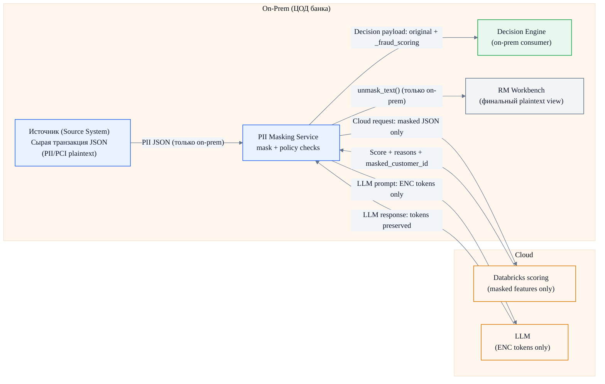
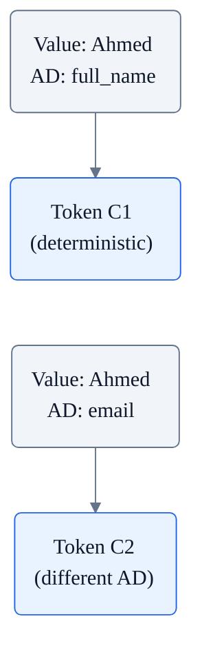
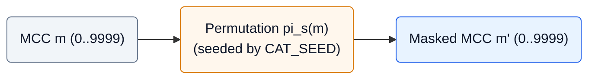
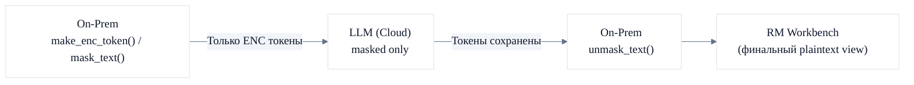
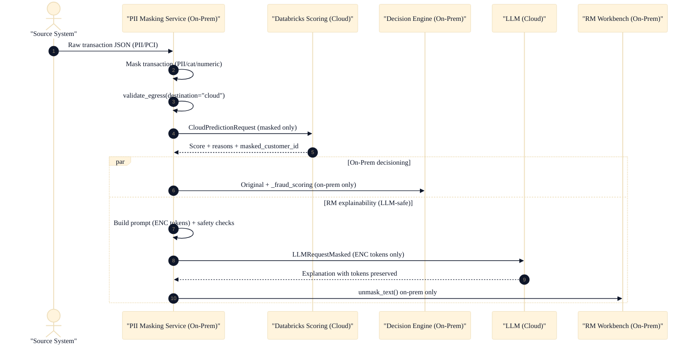

# PII Masking Service (Demo)

On-prem privacy-by-design pipeline для антифрода и RM explainability:
маскирование чувствительных полей, скоринг в облаке на masked-признаках, решение on-prem, и генерация RM текста через LLM без отправки plaintext в LLM.

English version: `README.md`

## Кратко (Executive Summary)

Этот репозиторий демонстрирует bank-grade подход: **data minimization + deterministic protection controls**.

Ключевые гарантии (как реализовано в коде):
- **Plaintext PII/PCI не уходит в облако** (облако видит только masked features).
- **Plaintext чувствительных значений не уходит в LLM** (LLM получает только детерминированные `[[ENC|...]]` токены).
- **Де-маскирование происходит только on-prem**, под флагами.
- Детерминированность сохраняет **joinability** (одинаковый вход, одинаковый выход).

## Security & Governance (почему это безопасно)

Это runtime-контроли (не только документация):

- **Data classification** прикреплена к полям схем (в Swagger видно `classification` metadata).
- **Egress policy enforcement** блокирует plaintext PII/PCI перед отправкой в cloud/LLM: `validate_egress(payload, destination="cloud"|"llm")`.
- **Проверка LLM prompt** блокирует случайную утечку plaintext в строке prompt (LLM request должен содержать только ENC токены).
- **Safe logging** редактирует/хеширует чувствительные поля, чтобы plaintext PII/PCI не попадал в логи.
- **Feature flags для unmask** делают вывод plaintext опциональным (`ENABLE_UNMASK`, `ENABLE_UNMASK_TEXT`).

## Архитектура (Один Слайд)



## Куда Что Уходит (Не-Технический Взгляд)

| Куда | Тип payload | Plaintext PII/PCI | Зачем |
|---|---|---|---|
| Cloud scoring (Databricks) | `CloudPredictionRequest` | Нет | Fraud scoring на masked-признаках |
| LLM (cloud) | `LLMRequestMasked` | Нет | Текст для RM, но только с ENC токенами |
| Decision Engine (on-prem) | Original + `_fraud_scoring` | Да (только on-prem) | Финальное решение on-prem |

## Трансформации Данных (Детерминированно и Обратимо)

### 1) PII/PCI: Детерминированное шифрование (AES-256-SIV)

Назначение: защита прямых идентификаторов (имя, телефон, email, PAN и т.д.) при сохранении детерминированности для join.

Формулы:

$$
C = \mathrm{Enc}_K(P; AD), \quad P = \mathrm{Dec}_K(C; AD)
$$

Детерминированность:

$$
(P_1 = P_2 \wedge AD_1 = AD_2) \Rightarrow (C_1 = C_2)
$$

Domain separation (разные поля, разный ciphertext):

$$
AD = \texttt{scb-demo|v1|} \Vert \texttt{field\\_name}
$$

Диаграмма (детерминизм + domain separation, AD включает имя поля):



### 2) Числа: Диагональная матрица (обратимая трансформация)

Назначение: демонстрация обратимого преобразования числовых полей, консистентного по каждому полю.

Формулы:

$$
\mathbf{x}' = D\mathbf{x}, \quad
D =
\begin{bmatrix}
s_1 & 0 & 0 \\
0 & s_2 & 0 \\
0 & 0 & s_3
\end{bmatrix}
$$

Пример:

$$
\mathbf{x} =
\begin{bmatrix}
275.50 \\
18350.75 \\
50000.00
\end{bmatrix},
\quad
D =
\begin{bmatrix}
1.37 & 0 & 0 \\
0 & 0.83 & 0 \\
0 & 0 & 1.11
\end{bmatrix},
\quad
\mathbf{x}' = D\mathbf{x} =
\begin{bmatrix}
377.435 \\
15231.1225 \\
55500.00
\end{bmatrix}
$$

<p align="center">
  
</p>

### 3) Категории: перестановка MCC + маппинг Channel

MCC (биективная перестановка по seed):

$$
m' = \pi_s(m), \quad m = \pi_s^{-1}(m')
$$



<p align="center">
  
</p>

Как читать этот график:
- Если `m' = m` (без маскирования), точки лежали бы на диагонали `y = x`.
- При seeded **перестановке** точки выглядят “перемешанными”, потому что числовая связь не сохраняется.
- Маппинг остаётся обратимым (при том же seed), но **частоты категорий** по-прежнему могут быть оценены на masked данных.

Channel (фиксированный обратимый маппинг):

$$
c' = f(c), \quad c = f^{-1}(c')
$$

<table>
  <tr>
    <td valign="top">
      <p>
        
      </p>
    </td>
    <td valign="top">
      <p><strong>Таблица маппинга</strong></p>
      <table>
        <thead>
          <tr>
            <th>Original</th>
            <th>Masked</th>
          </tr>
        </thead>
        <tbody>
          <tr><td><kbd>POS</kbd></td><td><kbd>CH_ALPHA</kbd></td></tr>
          <tr><td><kbd>ECOM</kbd></td><td><kbd>CH_BETA</kbd></td></tr>
          <tr><td><kbd>ATM</kbd></td><td><kbd>CH_GAMMA</kbd></td></tr>
          <tr><td><kbd>MOB</kbd></td><td><kbd>CH_DELTA</kbd></td></tr>
        </tbody>
      </table>
    </td>
  </tr>
</table>

## LLM Masked Exchange (plaintext не уходит в LLM)

Формат токена (LLM должен копировать токены без изменений):
`[[ENC|v1|<field_name>|<base64url_ciphertext>]]`



## Сквозной сценарий (Executive View)



Полная step-by-step версия (как в Demo UI): `sequence.md`

## Демо UI (Interactive Playback)

1. Запусти сервис: `uvicorn app.main:app --reload`
2. Открой демо UI: `http://localhost:8000/`
3. Или Swagger: `http://localhost:8000/docs`

<details>
<summary><strong>Инженерная справка (установка, API, конфигурация)</strong></summary>

## Быстрый старт

### Локально

```bash
# 1. Клонировать/создать директорию
cd PII-Masking-Service

# 2. Создать виртуальное окружение
python3.11 -m venv venv
source venv/bin/activate  # Linux/Mac
# или: venv\Scripts\activate  # Windows

# 3. Установить зависимости
pip install -r requirements.txt

# 4. Запустить сервис
uvicorn app.main:app --reload

# 5. Открыть Swagger UI
open http://localhost:8000/docs
```

### Docker

```bash
# Сборка
docker build -t pii-masking-service .

# Запуск (с переменными окружения)
docker run -d \
  -p 8000:8000 \
  -e PII_KEY_B64="your_base64_key_here" \
  -e ENABLE_UNMASK=true \
  --name pii-masking \
  pii-masking-service

# Проверка
curl http://localhost:8000/health
```

## API

### `GET /health`
Проверка состояния сервиса.

```bash
curl http://localhost:8000/health
```

Ответ:
```json
{
  "status": "ok",
  "version": "v1",
  "unmask_enabled": true
}
```

### `POST /v1/mask/transaction`
Маскирование транзакции.

```bash
curl -X POST http://localhost:8000/v1/mask/transaction \
  -H "Content-Type: application/json" \
  -d '{
    "transaction_id": "TXN-20260120-000001",
    "transaction_ts": "2026-01-20T10:15:30+03:00",
    "customer_id": "CUST-QA-00987234",
    "full_name": "Ahmed Al Mansoori",
    "phone": "+974 5512 3456",
    "email": "ahmed.almansoori@example.qa",
    "billing_address": "QA, Doha, West Bay, Diplomatic Area, Street 805, Building 12, Apt 1503",
    "card_pan": "4111111111111111",
    "merchant_id": "MRC-QA-778812",
    "merchant_name": "CARREFOUR CITY CENTER DOHA",
    "mcc": 5411,
    "merchant_country": "QA",
    "terminal_id": "TERM-QA-100200",
    "channel": "POS",
    "currency": "QAR",
    "amount": 275.50,
    "available_balance": 18350.75,
    "credit_limit": 50000.00,
    "ip_address": "203.0.113.10",
    "device_id": "DEV-qa-4f1c2a9b",
    "is_card_present": true
  }'
```

Ответ (структура):
```json
{
  "transaction_id": "TXN-20260120-000001",
  "transaction_ts": "2026-01-20T10:15:30+03:00",
  "customer_id": "PHqLs2NkZW1vfHYxfGN1c3RvbWVyX2lk...",
  "full_name": "AHJzY2ItZGVtb3x2MXxmdWxsX25hbWU...",
  "phone": "KHNjYi1kZW1vfHYxfHBob25l...",
  "email": "ZXNjYi1kZW1vfHYxfGVtYWls...",
  "billing_address": "YnNjYi1kZW1vfHYxfGJpbGxpbmdfYWRkcmVzcw...",
  "card_pan": "Y3NjYi1kZW1vfHYxfGNhcmRfcGFu...",
  "ip_address": "aXNjYi1kZW1vfHYxfGlwX2FkZHJlc3M...",
  "device_id": "ZHNjYi1kZW1vfHYxfGRldmljZV9pZA...",
  "merchant_id": "MRC-QA-778812",
  "merchant_name": "CARREFOUR CITY CENTER DOHA",
  "mcc": 7823,
  "merchant_country": "QA",
  "terminal_id": "TERM-QA-100200",
  "channel": "CH_ALPHA",
  "currency": "QAR",
  "amount": 377.435,
  "available_balance": 15231.1225,
  "credit_limit": 55500.0,
  "is_card_present": true,
  "mask_version": "v1"
}
```

### `POST /v1/unmask/transaction`
Восстановление исходной транзакции (только для демо).

```bash
curl -X POST http://localhost:8000/v1/unmask/transaction \
  -H "Content-Type: application/json" \
  -d '{"...masked transaction JSON...}'
```

### `POST /v1/mask/customer`
Маскирование профиля клиента.

```bash
curl -X POST http://localhost:8000/v1/mask/customer \
  -H "Content-Type: application/json" \
  -d '{
    "customer_id": "CUST-QA-00987234",
    "full_name": "Ahmed Al Mansoori",
    "phone": "+974 5512 3456",
    "email": "ahmed.almansoori@example.qa",
    "address": "QA, Doha, West Bay, Diplomatic Area, Street 805, Building 12, Apt 1503",
    "kyc_segment": "GOLD",
    "preferred_language": "EN"
  }'
```

### `POST /v1/mask/text`
Замена чувствительных значений на ENC токены.

```bash
curl -X POST http://localhost:8000/v1/mask/text \
  -H "Content-Type: application/json" \
  -d '{
    "text": "Call Ahmed about 275.50 QAR at CARREFOUR",
    "replacements": {
      "customer_name": "Ahmed",
      "amount": "275.50",
      "merchant_name": "CARREFOUR"
    }
  }'
```

### `POST /v1/unmask/text`
Восстановление ENC токенов (только для демо).

```bash
curl -X POST http://localhost:8000/v1/unmask/text \
  -H "Content-Type: application/json" \
  -d '{
    "masked_text": "Call [[ENC|v1|customer_name|...]] about [[ENC|v1|amount|...]]"
  }'
```

### `POST /v1/fraud/explain`
Полный on-prem -> cloud -> LLM -> RM поток. В LLM уходит только masked payload.

```bash
curl -X POST http://localhost:8000/v1/fraud/explain \
  -H "Content-Type: application/json" \
  -d '{
    "transaction": { "...sample transaction..." },
    "customer": { "...sample customer..." }
  }'
```

## Демо-клиент

```bash
# Запустить демонстрацию
python demo_client.py

# С другим URL
python demo_client.py --base-url http://192.168.1.100:8000
```

### End-to-End Explainability Demo

```bash
# Полный on-prem -> cloud -> LLM -> RM поток
python demo_end_to_end.py
```

Демо покажет:
1. ✅ Health check
2. 📤 Отправку транзакции на маскирование
3. 📊 Детали трансформаций (PII → ciphertext, числа × scale, категории)
4. 🔄 Проверку детерминированности (повторный запрос)
5. 🔓 Восстановление исходных данных (unmask)
6. ✔️ Верификацию совпадения

## Конфигурация

Переменные окружения (см. `.env.example`):

| Переменная | Описание | По умолчанию |
|------------|----------|--------------|
| `PII_KEY_B64` | Ключ шифрования (64 байта, base64) | Генерируется случайно |
| `MASK_VERSION` | Версия маскирования | `v1` |
| `ENABLE_UNMASK` | Включить /unmask endpoint | `true` |
| `ENABLE_UNMASK_TEXT` | Включить /unmask/text endpoint | `true` |
| `SCALE_AMOUNT` | Множитель для amount | `1.37` |
| `SCALE_AVAILABLE_BALANCE` | Множитель для available_balance | `0.83` |
| `SCALE_CREDIT_LIMIT` | Множитель для credit_limit | `1.11` |
| `CAT_SEED` | Seed для перестановки категорий | Derived from key |
| `LOG_HASH_SALT` | Соль для безопасного логирования | empty |

### Генерация ключа

```bash
python -c "import secrets, base64; print(base64.b64encode(secrets.token_bytes(64)).decode())"
```

## Структура проекта

```
PII-Masking-Service/
├── app/
│   ├── __init__.py
│   ├── main.py          # FastAPI приложение
│   ├── config.py        # Конфигурация и секреты
│   ├── schemas.py       # Pydantic модели
│   ├── masking.py       # Логика маскирования
│   ├── classification.py # Data classification + policy enforcement
│   ├── text_masking.py   # ENC токены для LLM
│   ├── cloud_stub.py     # Stub cloud scoring
│   └── llm_stub.py       # Stub LLM
├── requirements.txt
├── Dockerfile
├── .env.example
├── README.md
├── demo_client.py
└── demo_end_to_end.py
```

## Тестирование

```bash
# Запустить сервис
uvicorn app.main:app --reload &

# Запустить демо-клиент
python demo_client.py

# Health check
curl http://localhost:8000/health

# Swagger UI
open http://localhost:8000/docs
```

## Чеклист для демонстрации

- [ ] Запустить сервис: `uvicorn app.main:app --reload`
- [ ] Открыть Swagger UI: http://localhost:8000/docs
- [ ] Показать `/health` endpoint
- [ ] Показать `/v1/mask/transaction` со sample JSON
- [ ] Обратить внимание на:
  - PII поля стали base64url строками
  - Числа изменились (×scale)
  - MCC изменился (перестановка)
  - Channel изменился (маппинг)
  - Появился `mask_version`
- [ ] Повторить запрос — показать детерминированность
- [ ] Показать `/v1/unmask/transaction` — восстановление
- [ ] Запустить `demo_client.py` для автоматической демонстрации

</details>

## Документация

- RU: `docs/PII_Masking_Service_Design_ru.md`
- EN: `docs/PII_Masking_Service_Design_en.md`

Генерация графиков для документации:
```bash
pip install -r docs/requirements-docs.txt
python docs/generate_assets.py
```


## Лицензия

Internal use only. Not for distribution.

---

*Разработано для демонстрации концепции PII masking в card fraud detection pipeline.*
