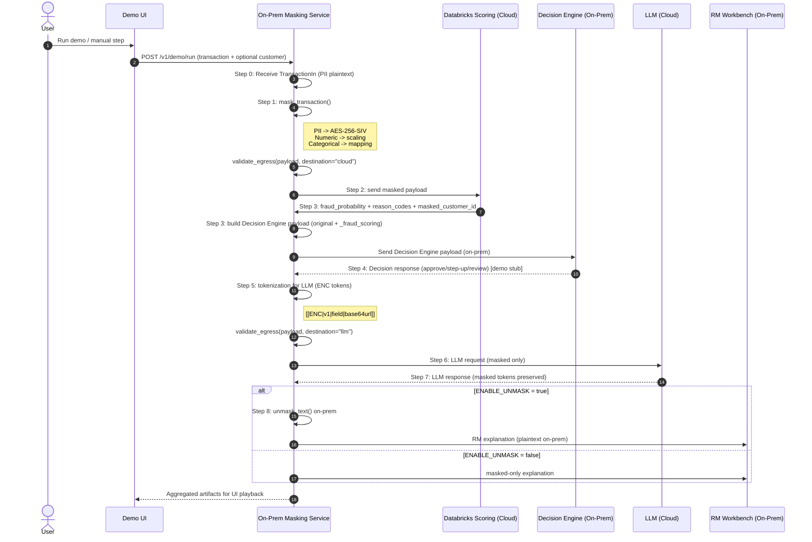
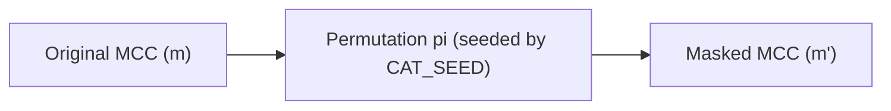

# PII Masking Service

Микросервис для маскирования/анонимизации карточных транзакций перед отправкой в облачную аналитику (Databricks) для антифрод-систем.

## 🎯 Цель

Безопасная передача транзакционных данных в облако с сохранением возможности:
- Обучения ML-моделей
- Скоринга транзакций
- JOIN-операций по ключам
- Аналитики без доступа к PII

## ✨ Возможности

| Тип данных | Трансформация | Обратимость |
|------------|---------------|-------------|
| PII поля | AES-256-SIV шифрование | ✅ |
| Числовые поля | Диагональная матрица (×scale) | ✅ |
| MCC | Биективная перестановка | ✅ |
| Channel | Детерминированный маппинг | ✅ |

**Все трансформации детерминированы** — одинаковый вход всегда даёт одинаковый выход.

Дополнительно:
- ✅ Data Classification на уровне схем (PUBLIC/INTERNAL/CONFIDENTIAL/PII/PCI)
- ✅ Policy enforcement перед egress в Cloud/LLM
- ✅ LLM explainability flow с ENC токенами `[[ENC|v1|field|ciphertext]]`

## 🔁 Sequence Diagram (End-to-End)



Кратко по шагам:
- Step 0: сервис принимает исходный JSON транзакции с PII.
- Step 1: маскирование (PII → AES-256-SIV, числа → scaling, категории → mapping).
- Step 2–3: отправка masked в облако и получение скоринга.
- Step 3–4: сборка payload для Decision Engine и решение (stub).
- Step 5–7: токенизация PII для LLM, запрос/ответ только в masked виде.
- Step 8: de-mask on-prem и выдача текста в RM Workbench.

## 📚 Documentation

- RU: `docs/PII_Masking_Service_Design_ru.md`
- EN: `docs/PII_Masking_Service_Design_en.md`

Генерация графиков для документации:
```bash
pip install -r docs/requirements-docs.txt
python docs/generate_assets.py
```

## 🚀 Быстрый старт

### Локально (3 минуты)

```bash
# 1. Клонировать/создать директорию
cd pii-masking-service

# 2. Создать виртуальное окружение
python3.11 -m venv venv
source venv/bin/activate  # Linux/Mac
# или: venv\Scripts\activate  # Windows

# 3. Установить зависимости
pip install -r requirements.txt

# 4. Запустить сервис
uvicorn app.main:app --reload

# 5. Открыть Swagger UI
open http://localhost:8000/docs
```

### Docker

```bash
# Сборка
docker build -t pii-masking-service .

# Запуск (с переменными окружения)
docker run -d \
  -p 8000:8000 \
  -e PII_KEY_B64="your_base64_key_here" \
  -e ENABLE_UNMASK=true \
  --name pii-masking \
  pii-masking-service

# Проверка
curl http://localhost:8000/health
```

## 📖 API

### `GET /health`
Проверка состояния сервиса.

```bash
curl http://localhost:8000/health
```

Ответ:
```json
{
  "status": "ok",
  "version": "v1",
  "unmask_enabled": true
}
```

### `POST /v1/mask/transaction`
Маскирование транзакции.

```bash
curl -X POST http://localhost:8000/v1/mask/transaction \
  -H "Content-Type: application/json" \
  -d '{
    "transaction_id": "TXN-20260120-000001",
    "transaction_ts": "2026-01-20T10:15:30+03:00",
    "customer_id": "CUST-QA-00987234",
    "full_name": "Ahmed Al Mansoori",
    "phone": "+974 5512 3456",
    "email": "ahmed.almansoori@example.qa",
    "billing_address": "QA, Doha, West Bay, Diplomatic Area, Street 805, Building 12, Apt 1503",
    "card_pan": "4111111111111111",
    "merchant_id": "MRC-QA-778812",
    "merchant_name": "CARREFOUR CITY CENTER DOHA",
    "mcc": 5411,
    "merchant_country": "QA",
    "terminal_id": "TERM-QA-100200",
    "channel": "POS",
    "currency": "QAR",
    "amount": 275.50,
    "available_balance": 18350.75,
    "credit_limit": 50000.00,
    "ip_address": "203.0.113.10",
    "device_id": "DEV-qa-4f1c2a9b",
    "is_card_present": true
  }'
```

Ответ (структура):
```json
{
  "transaction_id": "TXN-20260120-000001",
  "transaction_ts": "2026-01-20T10:15:30+03:00",
  "customer_id": "PHqLs2NkZW1vfHYxfGN1c3RvbWVyX2lk...",
  "full_name": "AHJzY2ItZGVtb3x2MXxmdWxsX25hbWU...",
  "phone": "KHNjYi1kZW1vfHYxfHBob25l...",
  "email": "ZXNjYi1kZW1vfHYxfGVtYWls...",
  "billing_address": "YnNjYi1kZW1vfHYxfGJpbGxpbmdfYWRkcmVzcw...",
  "card_pan": "Y3NjYi1kZW1vfHYxfGNhcmRfcGFu...",
  "ip_address": "aXNjYi1kZW1vfHYxfGlwX2FkZHJlc3M...",
  "device_id": "ZHNjYi1kZW1vfHYxfGRldmljZV9pZA...",
  "merchant_id": "MRC-QA-778812",
  "merchant_name": "CARREFOUR CITY CENTER DOHA",
  "mcc": 7823,
  "merchant_country": "QA",
  "terminal_id": "TERM-QA-100200",
  "channel": "CH_ALPHA",
  "currency": "QAR",
  "amount": 377.435,
  "available_balance": 15231.1225,
  "credit_limit": 55500.0,
  "is_card_present": true,
  "mask_version": "v1"
}
```

### `POST /v1/unmask/transaction`
Восстановление исходной транзакции (только для демо).

```bash
curl -X POST http://localhost:8000/v1/unmask/transaction \
  -H "Content-Type: application/json" \
  -d '{"...masked transaction JSON...}'
```

### `POST /v1/mask/customer`
Маскирование профиля клиента.

```bash
curl -X POST http://localhost:8000/v1/mask/customer \
  -H "Content-Type: application/json" \
  -d '{
    "customer_id": "CUST-QA-00987234",
    "full_name": "Ahmed Al Mansoori",
    "phone": "+974 5512 3456",
    "email": "ahmed.almansoori@example.qa",
    "address": "QA, Doha, West Bay, Diplomatic Area, Street 805, Building 12, Apt 1503",
    "kyc_segment": "GOLD",
    "preferred_language": "EN"
  }'
```

### `POST /v1/mask/text`
Замена чувствительных значений на ENC токены.

```bash
curl -X POST http://localhost:8000/v1/mask/text \
  -H "Content-Type: application/json" \
  -d '{
    "text": "Call Ahmed about 275.50 QAR at CARREFOUR",
    "replacements": {
      "customer_name": "Ahmed",
      "amount": "275.50",
      "merchant_name": "CARREFOUR"
    }
  }'
```

### `POST /v1/unmask/text`
Восстановление ENC токенов (только для демо).

```bash
curl -X POST http://localhost:8000/v1/unmask/text \
  -H "Content-Type: application/json" \
  -d '{
    "masked_text": "Call [[ENC|v1|customer_name|...]] about [[ENC|v1|amount|...]]"
  }'
```

### `POST /v1/fraud/explain`
Полный on-prem -> cloud -> LLM -> RM поток. В LLM уходит только masked payload.

```bash
curl -X POST http://localhost:8000/v1/fraud/explain \
  -H "Content-Type: application/json" \
  -d '{
    "transaction": { "...sample transaction..." },
    "customer": { "...sample customer..." }
  }'
```

## 🎮 Демо-клиент

```bash
# Запустить демонстрацию
python demo_client.py

# С другим URL
python demo_client.py --base-url http://192.168.1.100:8000
```

### End-to-End Explainability Demo

```bash
# Полный on-prem -> cloud -> LLM -> RM поток
python demo_end_to_end.py
```

Демо покажет:
1. ✅ Health check
2. 📤 Отправку транзакции на маскирование
3. 📊 Детали трансформаций (PII → ciphertext, числа × scale, категории)
4. 🔄 Проверку детерминированности (повторный запрос)
5. 🔓 Восстановление исходных данных (unmask)
6. ✔️ Верификацию совпадения

## ⚙️ Конфигурация

Переменные окружения (см. `.env.example`):

| Переменная | Описание | По умолчанию |
|------------|----------|--------------|
| `PII_KEY_B64` | Ключ шифрования (64 байта, base64) | Генерируется случайно |
| `MASK_VERSION` | Версия маскирования | `v1` |
| `ENABLE_UNMASK` | Включить /unmask endpoint | `true` |
| `ENABLE_UNMASK_TEXT` | Включить /unmask/text endpoint | `true` |
| `SCALE_AMOUNT` | Множитель для amount | `1.37` |
| `SCALE_AVAILABLE_BALANCE` | Множитель для available_balance | `0.83` |
| `SCALE_CREDIT_LIMIT` | Множитель для credit_limit | `1.11` |
| `CAT_SEED` | Seed для перестановки категорий | Derived from key |
| `LOG_HASH_SALT` | Соль для безопасного логирования | empty |

### Генерация ключа

```bash
python -c "import secrets, base64; print(base64.b64encode(secrets.token_bytes(64)).decode())"
```

## 🔐 Безопасность

### Шифрование PII
- Алгоритм: **AES-256-SIV** (Synthetic IV)
- Детерминированный AEAD — одинаковый вход → одинаковый выход
- Domain separation: разные поля с одинаковым значением дают разный ciphertext
- Associated Data: `scb-demo|v1|{field_name}`

### ENC токены для LLM
LLM не получает plaintext данных. Вместо этого в запросе используются токены:

```
[[ENC|v1|<field_name>|<base64url_ciphertext>]]
```

- Токены формируются on-prem из реальных значений (строки/числа)
- LLM должен копировать токены как есть
- После ответа выполняется `unmask_text()` и восстанавливается человекочитаемый текст

### Числовые поля
- Диагональная матрица: `x_masked = x × scale_factor`
- Scale factors хранятся как секрет сервиса
- Обратимость: `x = x_masked / scale_factor`

Пример (умножение на диагональную матрицу):

$$
\mathbf{x} =
\begin{bmatrix}
275.50 \\
18350.75 \\
50000.00
\end{bmatrix},
\quad
D =
\begin{bmatrix}
1.37 & 0 & 0 \\
0 & 0.83 & 0 \\
0 & 0 & 1.11
\end{bmatrix}
$$

$$
\mathbf{x}' = D\mathbf{x} =
\begin{bmatrix}
377.435 \\
15231.1225 \\
55500.00
\end{bmatrix}
$$

### Категориальные поля
- **MCC**: биективная перестановка 0-9999 по seed
- **Channel**: фиксированный маппинг (POS→CH_ALPHA, etc.)

Визуализация (seeded bijection для MCC):



Пример (иллюстративно; реальные значения зависят от CAT_SEED):
- `m = 5411` → `m' = 7823`


Как читать scatterplot: каждая точка — это взаимно-однозначное отображение
исходного MCC (ось X) в замаскированный MCC (ось Y). Идеальная диагональ означала бы
отсутствие маскирования; «разброс» показывает перестановку при сохранении биекции.

## 📁 Структура проекта

```
pii-masking-service/
├── app/
│   ├── __init__.py
│   ├── main.py          # FastAPI приложение
│   ├── config.py        # Конфигурация и секреты
│   ├── schemas.py       # Pydantic модели
│   ├── masking.py       # Логика маскирования
│   ├── classification.py # Data classification + policy enforcement
│   ├── text_masking.py   # ENC токены для LLM
│   ├── cloud_stub.py     # Stub cloud scoring
│   └── llm_stub.py       # Stub LLM
├── requirements.txt
├── Dockerfile
├── .env.example
├── README.md
├── demo_client.py
└── demo_end_to_end.py
```

## 🧪 Тестирование

```bash
# Запустить сервис
uvicorn app.main:app --reload &

# Запустить демо-клиент
python demo_client.py

# Health check
curl http://localhost:8000/health

# Swagger UI
open http://localhost:8000/docs
```

## 📋 Чеклист для демонстрации

- [ ] Запустить сервис: `uvicorn app.main:app --reload`
- [ ] Открыть Swagger UI: http://localhost:8000/docs
- [ ] Показать `/health` endpoint
- [ ] Показать `/v1/mask/transaction` со sample JSON
- [ ] Обратить внимание на:
  - PII поля стали base64url строками
  - Числа изменились (×scale)
  - MCC изменился (перестановка)
  - Channel изменился (маппинг)
  - Появился `mask_version`
- [ ] Повторить запрос — показать детерминированность
- [ ] Показать `/v1/unmask/transaction` — восстановление
- [ ] Запустить `demo_client.py` для автоматической демонстрации

## 📜 Лицензия

Internal use only. Not for distribution.

---

*Разработано для демонстрации концепции PII masking в card fraud detection pipeline.*
