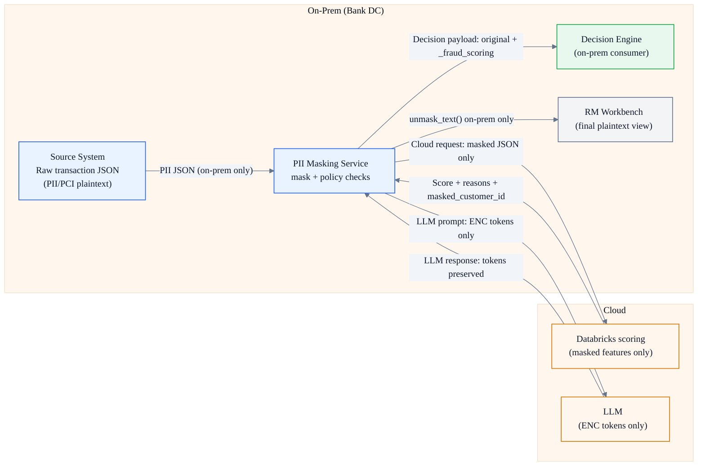
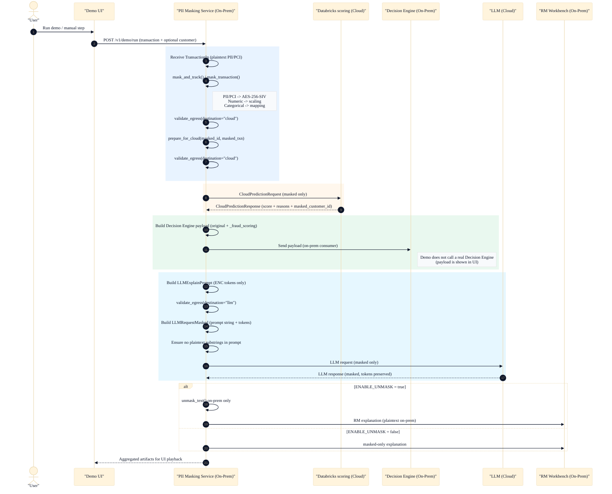

# End-to-End Sequence (PII Masking Service)

This is an executive-friendly walkthrough aligned with the demo playback endpoint: `POST /v1/demo/run` (see `app/main.py`).

## Executive View (One Slide)

## Glossary (Key Identifiers)

- `masked_id`: per-transaction tracking id (format like `MASK-...`), safe to use for joining artifacts in the demo.
- `masked_customer_id` / `token_customer_id`: deterministic customer token returned by cloud scoring (derived from masked inputs).
- `[[ENC|v1|field|ciphertext]]`: deterministic ENC token used in LLM prompts and responses (the LLM must copy tokens as-is).

## Step-by-Step Walkthrough (What Happens and Where)

| Step | Where | What happens | Plaintext PII/PCI leaves on-prem? |
|---|---|---|---|
| 0 | On-Prem | Receive `FraudExplainRequest` (`transaction` + optional `customer`) | No |
| 1 | On-Prem | Mask transaction (`mask_and_track()` / `mask_transaction()`): PII/PCI encrypt, numeric scale, categories map | No |
| 2 | On-Prem | Enforce cloud policy: `validate_egress(..., destination="cloud")` | No |
| 3 | Cloud (stub) | Score masked features: `score_transaction(masked_txn)` returns `fraud_probability`, `reason_codes`, `masked_customer_id` | No |
| 4 | On-Prem | Build Decision Engine payload: original + `_fraud_scoring` (on-prem consumer) | No |
| 5 | On-Prem | Build LLM prompt with ENC tokens only + enforce LLM policy | No |
| 6 | Cloud (stub) | Generate masked explanation text (tokens preserved) | No |
| 7 | On-Prem | Optional de-mask for RM Workbench (`ENABLE_UNMASK=true`) | No (on-prem only) |

<strong>Mermaid sequence diagram (engineering trace)</strong>

