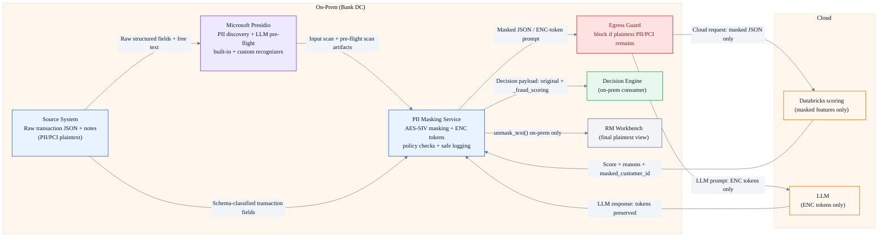
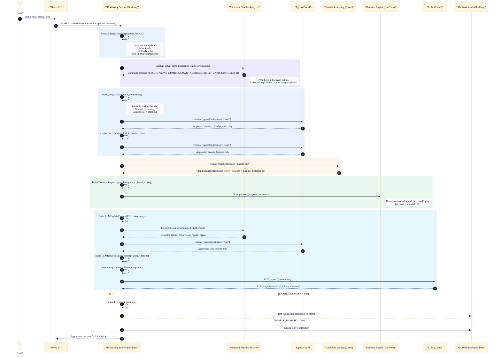

# End-to-End Sequence (PII Masking Service)

This is an executive-friendly walkthrough for the end-to-end architecture. The demo playback endpoint `POST /v1/demo/run` now includes Presidio artifacts inside the same sequence: input PII discovery before masking and LLM prompt pre-flight scanning before egress. The standalone `/pii/*` endpoints remain developer references, while encryption, ENC tokenization, egress validation, and safe logging remain the enforcement controls.

## Executive View (One Slide)

## Glossary (Key Identifiers)

- `masked_id`: per-transaction tracking id (format like `MASK-...`), safe to use for joining artifacts in the demo.
- `masked_customer_id` / `token_customer_id`: deterministic customer token returned by cloud scoring (derived from masked inputs).
- `[[ENC|v1|field|ciphertext]]`: deterministic ENC token used in LLM prompts and responses (the LLM must copy tokens as-is).
- `Presidio`: on-prem discovery signal for free text; not a replacement for encryption, tokenization, safe logging, or egress validation.

## Step-by-Step Walkthrough (What Happens and Where)

| Step | Where | What happens | Plaintext PII/PCI leaves on-prem? |
|---|---|---|---|
| 0 | On-Prem | Receive `FraudExplainRequest` (`transaction` + optional `customer`) with synthetic demo data such as `John Smith`, `+974 5512 3456`, and `john.smith@example.com` | No |
| 1 | On-Prem / Presidio | Scan the actual demo transaction text with Microsoft Presidio to identify candidate PII entities and confidence scores | No |
| 2 | On-Prem | Mask transaction (`mask_and_track()` / `mask_transaction()`): PII/PCI encrypt, numeric scale, categories map | No |
| 3 | On-Prem | Enforce cloud policy: `validate_egress(..., destination="cloud")` | No |
| 4 | Cloud (stub) | Score masked features: `score_transaction(masked_txn)` returns `fraud_probability`, `reason_codes`, `masked_customer_id` | No |
| 5 | On-Prem | Build Decision Engine payload: original + `_fraud_scoring` for an on-prem consumer | No |
| 6 | On-Prem | Build LLM prompt with ENC tokens only | No |
| 7 | On-Prem / Presidio | Run Presidio pre-flight scan on the actual masked LLM prompt before egress | No |
| 8 | On-Prem | Enforce LLM policy: `validate_egress(..., destination="llm")` and plaintext substring safety checks | No |
| 9 | Cloud (stub) | Generate masked explanation text; LLM receives and returns ENC tokens only | No |
| 10 | On-Prem | Optional de-mask for RM Workbench (`ENABLE_UNMASK=true`) | No (on-prem only) |

<strong>Mermaid sequence diagram (engineering trace)</strong>

In this demo, Presidio pre-flight findings are surfaced as artifacts for reviewer visibility. The hard egress controls are `validate_egress(...)` and plaintext substring checks. Production policy can choose to block or re-mask based on Presidio findings.

