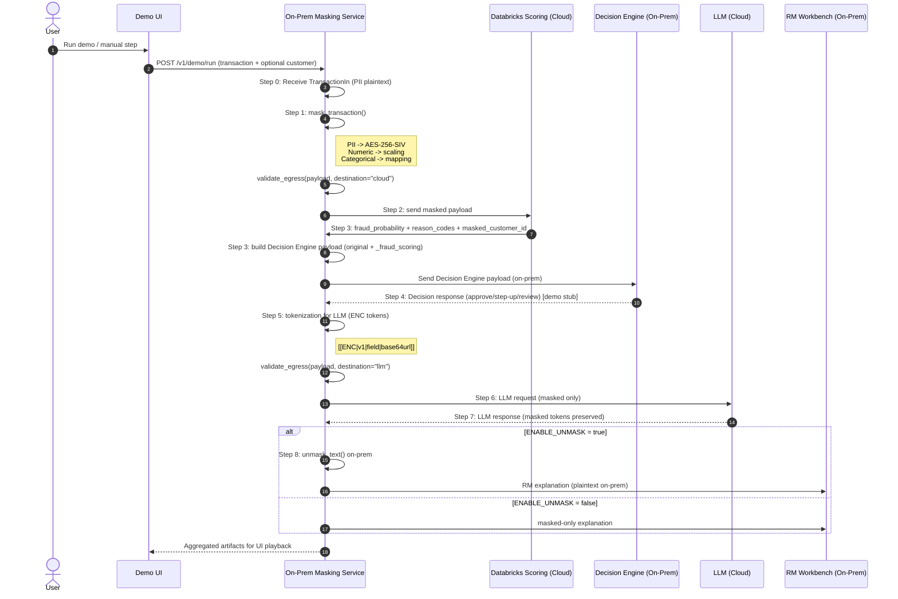

# End-to-End Sequence (PII Masking Service)

Summary:
- Step 0: Receive transaction JSON with PII.
- Step 1: Masking (PII → AES-256-SIV, numeric → scaling, categorical → mapping).
- Step 2–3: Cloud scoring round-trip with masked payload.
- Step 3–4: Decision Engine payload + decision response (stub).
- Step 5–7: Tokenize PII for LLM, masked request/response.
- Step 8: On-prem de-mask and RM output.
